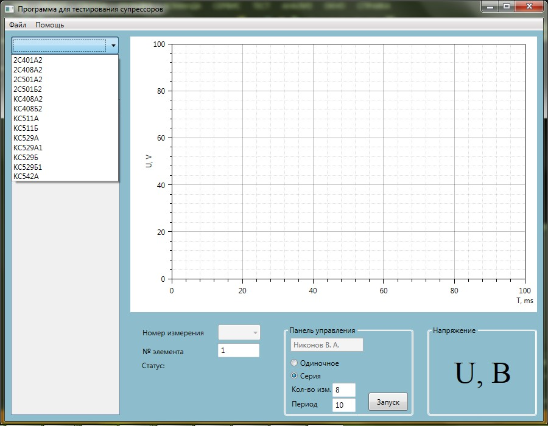
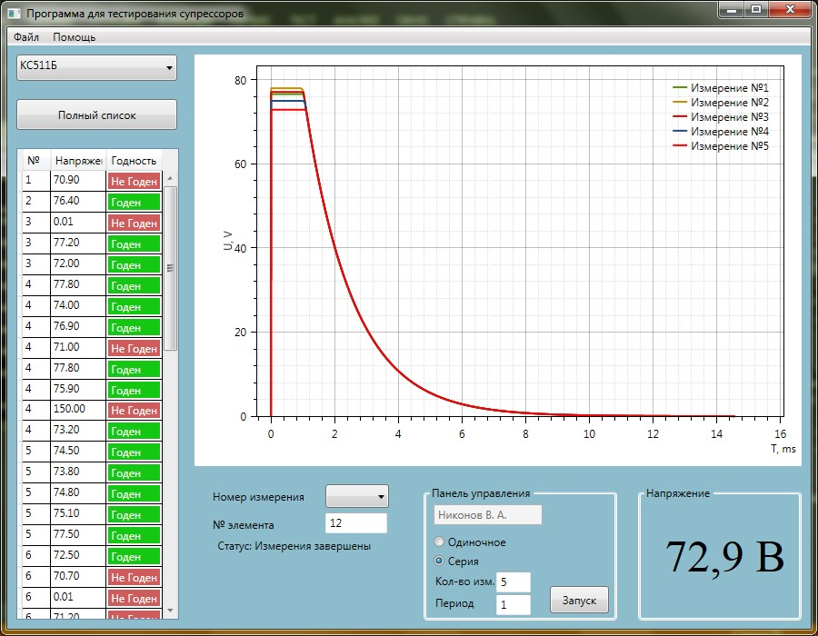
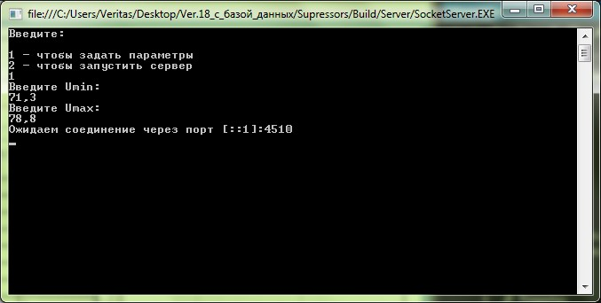

# Test-supressors
Programm for testing supressors and server-simulator. Included database, draw graphics

## What's included?

* Add / change / delete measurments in database
* Validity test of a sample
* Construction of oscillograms
* Server simulating the installation

## Demos

Main window:

Main window in process:

Server:

